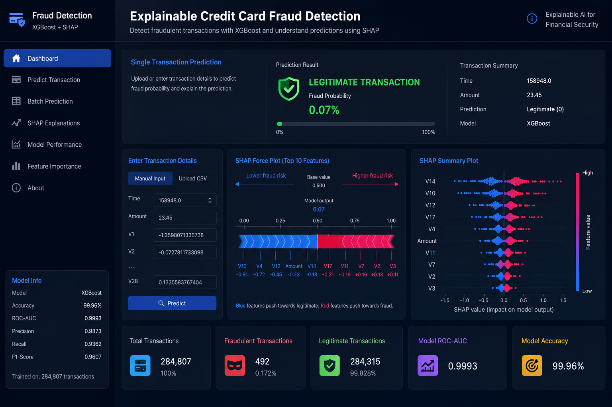

<div align="center">

# Explainable Credit Card Fraud Detection using XGBoost and SHAP

### Building Transparent AI for Financial Fraud Detection

An end-to-end machine learning pipeline for detecting fraudulent credit card transactions using ensemble learning and Explainable Artificial Intelligence (XAI). The project combines multiple classification models with SHAP to provide accurate and interpretable fraud predictions on highly imbalanced financial transaction data.




</div>

---

# Project Overview

Credit card fraud causes billions of dollars in financial losses every year. Detecting fraudulent transactions is particularly challenging because fraud cases represent only a tiny fraction of all transactions, creating a highly imbalanced classification problem.

This project develops an explainable fraud detection system capable of accurately identifying fraudulent transactions while also explaining **why** a prediction was made using SHAP (SHapley Additive exPlanations). The result is an AI system that is both accurate and transparent—an important requirement for modern financial applications.

---

# Features

- End-to-end fraud detection pipeline
- Data preprocessing and feature engineering
- Handling highly imbalanced datasets
- Feature scaling and normalization
- Multiple machine learning baseline models
- XGBoost optimized fraud detector
- SHAP Explainable AI integration
- Feature importance visualization
- Transaction-level prediction explanations
- Comprehensive model evaluation

---

# Dataset

**Dataset:** Kaggle Credit Card Fraud Detection Dataset

Dataset Characteristics:

- European credit card transactions
- 284,807 total transactions
- 492 fraudulent transactions
- 30 anonymized numerical features
- Binary classification task
- Severe class imbalance (0.172% fraud)

The dataset contains PCA-transformed features (`V1`–`V28`) along with:

- Time
- Amount
- Class (Target)

Target:

- **0 → Legitimate Transaction**
- **1 → Fraudulent Transaction**

---

# Project Pipeline

```text
Raw Dataset
      │
      ▼
Data Cleaning
      │
      ▼
Feature Scaling
      │
      ▼
Train-Test Split
      │
      ▼
Class Imbalance Handling
      │
      ▼
Model Training
      │
      ▼
Performance Evaluation
      │
      ▼
Best Model Selection (XGBoost)
      │
      ▼
SHAP Explainability
      │
      ▼
Fraud Prediction + Interpretation
```

---

# Machine Learning Models

The following models were trained and compared:

- Logistic Regression
- Decision Tree
- Random Forest
- XGBoost

Each model was evaluated using multiple classification metrics to determine the most effective fraud detector.

---

# Evaluation Metrics

Models were evaluated using:

- Accuracy
- Precision
- Recall
- F1-Score
- ROC-AUC Score
- Confusion Matrix

These metrics provide a balanced understanding of performance on highly imbalanced fraud detection datasets.

---

# Explainable AI with SHAP

To improve model transparency, SHAP was integrated into the pipeline.

SHAP provides:

- Global feature importance
- Local transaction explanations
- Positive and negative feature contributions
- Individual prediction interpretability
- Model transparency for financial decision making

This enables users to understand exactly **why** a transaction was classified as fraudulent.

---

# Project Structure

```text
Explainable-Credit-Card-Fraud-Detection/
│
├── data/
│   └── creditcard.csv
│
├── notebooks/
│   └── fraud_detection.ipynb
│
├── images/
│   ├── banner.png
│   ├── pipeline.png
│   ├── shap_summary.png
│   ├── shap_force.png
│   └── confusion_matrix.png
│
├── models/
│   └── xgboost_model.pkl
│
├── requirements.txt
├── README.md
└── LICENSE
```

---

# Installation

Clone the repository

```bash
git clone https://github.com/yourusername/Explainable-Credit-Card-Fraud-Detection.git
```

Move into the project

```bash
cd Explainable-Credit-Card-Fraud-Detection
```

Install dependencies

```bash
pip install -r requirements.txt
```

Run the notebook

```bash
jupyter notebook
```

---

# Libraries Used

- Python
- NumPy
- Pandas
- Matplotlib
- Seaborn
- Scikit-Learn
- XGBoost
- SHAP
- Joblib

---

# Sample Visualizations

The repository includes visualizations such as:

- Feature Importance
- SHAP Summary Plot
- SHAP Force Plot
- ROC Curve
- Confusion Matrix
- Precision-Recall Curve

---

# Applications

This project can be applied to:

- Banking Systems
- Credit Card Fraud Detection
- Financial Risk Management
- FinTech Platforms
- Payment Gateways
- Fraud Monitoring Systems

---

# Future Improvements

- Deep Learning models
- LightGBM comparison
- CatBoost implementation
- Hyperparameter optimization
- Real-time fraud detection API
- Streamlit dashboard
- Docker deployment
- Cloud deployment
- Model monitoring pipeline

---

# Tech Stack

| Category | Technologies |
|----------|--------------|
| Programming | Python |
| Machine Learning | Scikit-Learn, XGBoost |
| Explainable AI | SHAP |
| Data Processing | Pandas, NumPy |
| Visualization | Matplotlib, Seaborn |

---

# Repository Highlights

- Explainable AI Integration
- XGBoost-based Fraud Detection
- Multiple Model Benchmarking
- Highly Imbalanced Dataset Handling
- Financial Machine Learning
- Transparent Predictions
- End-to-End ML Pipeline


---

<div align="center">

### If you found this project useful, consider giving it a star!

**Building Trustworthy AI for Financial Security**

</div>